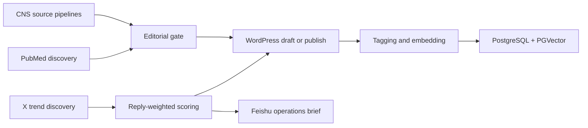

# Longevity AI Workflows

一套面向长寿科学媒体的 AI 信息系统：从不同学术来源发现内容、过滤噪声、生成编辑稿，再将文章沉淀为可检索的向量知识库，并监控 X 上的新兴讨论。

这不是一个通用 SaaS，也不是把所有步骤都交给 Agent。它是为真实编辑需求搭建的四组工作流，核心原则是：**代码负责确定性逻辑，模型负责语义判断，关键发布节点保留质量控制。**

> 项目周期：2026.01-2026.06。仓库为作品集版本，所有工作流均已脱敏并默认关闭。

## 项目结果

- 覆盖 40+ 学术期刊与行业信源
- 累积处理 300+ 篇文章
- 生成 1,400+ 语义分块
- 建立多轴内容分类体系与 1024 维向量索引
- 将研究发现、热点判断、编辑建议和发布链路连接为可运行系统

## 为什么需要四条不同工作流

同一个“发现长寿研究”的目标，在不同来源上是四类问题：

- Cell、Nature、Science 的入口、内容结构和反爬策略不同，强行统一会增加耦合与调试成本。
- PubMed 覆盖面广，但“研究对象是老年人”不等于“研究衰老机制”，需要规则筛选与语义筛选结合。
- 发布后的文章如果只留在 WordPress，无法支持语义检索、跨文章关联和后续 RAG。
- X 的热点不能只看点赞数，需要更重视真实讨论，并主动降低头部 KOL 对榜单的支配。



## 工作流一览

| 工作流 | 节点数 | 解决的问题 | 公开文件 |
|---|---:|---|---|
| CNS 自动化 | 77 | 适配 Cell / Nature / Science 的差异化采集与编辑 | `workflows/cns-automation.redacted.json` |
| PubMed 发现与编辑 | 37 | 在大范围期刊中寻找真正与衰老机制相关的研究 | `workflows/pubmed-discovery.redacted.json` |
| 知识库向量化 | 17 | 将文章、分类标签和语义分块写入 PGVector | `workflows/knowledge-base-vectorization.redacted.json` |
| X 热点监控 | 15 | 发现高讨论度帖子并生成可执行的运营简报 | `workflows/x-trend-monitor.redacted.json` |

## 1. CNS：同一目标，三种采集策略

Cell、Nature、Science 分别使用独立入口和容错逻辑，之后共享统一的相关性审核、内容生成与发布链路。

### Cell Press

- 使用关键词与时间范围构造搜索入口
- 抓取列表后再批量获取文章详情
- 面对 Cloudflare，比较过直接请求、代理服务、自部署 FlareSolverr 与 Firecrawl
- 最终使用“RSS/列表发现 + 单篇详情抓取”的分层方案

### Nature

- 使用 Google Sheets 管理多个 RSS 信源
- 统一不同日期字段并过滤时间窗口
- RSS 摘要不足时进入详情页补全
- 按 `Abstract > Summary > Main` 回退获取正文信息

### Science

- 直接读取原始 RSS XML
- 自定义解析带命名空间的字段
- 对不同摘要结构设置多级内容回退

## 2. PubMed：搜索规则与 AI 守门员结合

PubMed 不是“搜到 aging 就发布”。工作流使用两条并行通道：

1. **优先期刊通道**：对重点来源设置较小的结果窗口，保证高价值来源及时进入处理。
2. **广域发现通道**：检索其他 PubMed 期刊，同时排除已经由 CNS 或独立 RSS 管线覆盖的来源，减少重复。

每条结果随后经历：

```text
时间与关键词检索
-> PubMed XML 全文元数据
-> PMID 去重
-> 已覆盖期刊排除
-> 严格语义守门
-> 编辑稿生成
-> WordPress
```

守门员重点排除：

- 只因研究对象年龄较高而命中，但不讨论衰老机制的文章
- 纯老年护理、生活质量、社会心理或流行病学统计
- 只有常规临床疗效、剂量或药代数据，没有衰老机制贡献
- 一般综述、系统评价与更正信息

优先保留：细胞衰老、表观遗传时钟、线粒体、干细胞耗竭、mTOR / AMPK / Sirtuins、自噬、免疫衰老等机制研究，以及直接影响寿命或健康寿命的干预。

详见 [`docs/pubmed-screening.md`](docs/pubmed-screening.md)。

## 3. PostgreSQL + PGVector：把内容变成可检索资产

文章发布后，系统定时同步 WordPress 内容并执行：

```text
HTML 清洗
-> 多轴标签解析
-> 标题与摘要 embedding
-> articles 表幂等 upsert
-> 长文按语义边界切块
-> chunk embedding
-> article_chunks 表幂等 upsert
-> 更新切块状态
```

设计细节：

- 摘要向量和全文分块向量分开存储，兼顾快速召回与细粒度检索
- 向量维度固定为 1024，并在写库前校验
- 超过 1,000 字的文章进入切块流程
- 目标块长 400 字、重叠 60 字，优先在段落、换行和句末标点处切分
- 文章以 `slug` 幂等更新，分块以 `article_id + chunk_index` 幂等更新

## 4. X 热点监控：优先发现讨论，而不是大号

工作流在最近 8 小时的搜索窗口内获取长寿与健康相关帖子，完成去重和基础清洗后：

- 排除预设的头部 KOL，避免榜单长期被固定账号占据
- 设置最低门槛：回复不少于 5、点赞不少于 20、回复/点赞不少于 3%
- 对回复赋予最高权重，突出真正引发讨论的内容

```text
engagement_score = replies * 5 + reposts * 2 + likes * 0.5
```

Top 5 进入中文翻译、长寿视角、回复切入点和评论氛围分析；Top 2 可继续进入文章生成。结果以飞书卡片推送给运营，并保留原帖链接追溯。

详见 [`docs/trend-scoring.md`](docs/trend-scoring.md)。

## 关键设计原则

### 代码与模型分工

日期处理、字段映射、PMID 去重、阈值过滤、评分、切块和数据库写入使用代码；相关性判断、分类、摘要和内容角度使用模型。

### 不追求“所有环节都 Agent 化”

固定、可验证的步骤优先使用脚本和工作流。只有需要开放式判断、工具选择或多轮修正的任务，才适合使用 Agentic 方式。

### 多入口，统一出口

采集端按来源拆分，编辑标准、数据结构和发布接口统一。这样可以单独调试某个来源，而不影响整套系统。

### 自动化不等于取消控制

工作流支持端到端运行，但发布模式和异常降级可以按风险配置为草稿、人工复核或自动发布。

## 仓库结构

```text
.
├── README.md
├── docs/
│   ├── cns-workflow-diagram.png
│   ├── pubmed-screening.md
│   ├── trend-scoring.md
│   └── workflow-handoff.md
└── workflows/
    ├── cns-automation.redacted.json
    ├── pubmed-discovery.redacted.json
    ├── knowledge-base-vectorization.redacted.json
    └── x-trend-monitor.redacted.json
```

## 导入前准备

1. 在 n8n 中导入所需 JSON。
2. 重新连接模型、数据库、WordPress、飞书和其他凭证。
3. 替换所有 `YOUR_*` 与 `REDACTED_*` 占位符。
4. 检查模型名称、API 端点、数据库表结构和分类 ID。
5. 使用测试数据运行，确认发布状态后再启用 Schedule Trigger。

具体交接步骤见 [`docs/workflow-handoff.md`](docs/workflow-handoff.md)。

## 安全说明

- 所有 API key、Bearer Token、Basic Auth、Webhook、credential ID、instance ID 与 workflow ID 均已删除或替换。
- 所有公开工作流默认 `active: false`。
- 仓库不包含生产数据库数据、私有 Sheet ID 或真实用户数据。
- 导入后必须在自己的 n8n 环境中重新配置凭证。

## 技术栈

n8n · JavaScript · PubMed E-utilities · Firecrawl · DeepSeek · Gemini · Grok · OpenRouter · WordPress REST API · PostgreSQL · PGVector · BAAI/bge-m3 · Feishu

## 相关产品

- 线上产品：[Longevity Foresight](https://longevityforesight.com/)
- 另一个 AI 内容重构实验：[阅读卡兹克公众号的五种新视角](https://five-lenses-of-khazix.pages.dev/)
