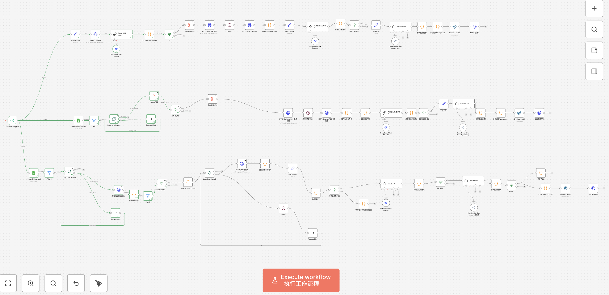

# Longevity Foresight — CNS 抗衰研究自动化采集与发布系统

> 从 Cell / Nature / Science 三大顶刊中，每天自动发现、筛选、解读并发布抗衰老/长寿领域的最新科学研究。
> 
> 覆盖 40+ 学术期刊，全流程无人干预，论文上线到中文快讯发布延迟 < 24 小时。
>
> 线上产品：[longevityforesight.com](https://longevityforesight.com/)

---

## 系统架构

三条独立采集管线，分别适配 Cell Press、Nature、Science 三大出版体系的信息结构和反爬策略。三条管线共享统一的 AI 审核 → 内容生成 → 发布后处理链路。

```
 ┌───────────────────────────────────────────────────────┐
 │               Schedule Trigger (每日 8:00)              │
 └─────────┬─────────────┬──────────────┬────────────────┘
           │             │              │
     ┌─────▼─────┐ ┌─────▼─────┐ ┌─────▼─────┐
     │ Cell Press│ │  Nature   │ │  Science  │
     │   管线    │ │   管线    │ │   管线    │
     └─────┬─────┘ └─────┬─────┘ └─────┬─────┘
           │             │              │
           └─────────────┼──────────────┘
                         │
    ┌────────────────────▼──────────────────────┐
    │        AI 相关性审核 (DeepSeek)            │
    │  Gatekeeper: 判断是否属于抗衰/长寿科学范畴  │
    └────────────────────┬──────────────────────┘
                         │
    ┌────────────────────▼──────────────────────┐
    │      内容生成 (Gemini 2.5 Flash)           │
    │  中文化 + 编辑视角 Takeaway + SEO 元数据    │
    └────────────────────┬──────────────────────┘
                         │
    ┌────────────────────▼──────────────────────┐
    │    WordPress 发布 (Draft) + SEO 注入       │
    └───────────────────────────────────────────┘
```



---

## 三条管线的差异化设计

同一目标，三种策略。每个出版平台的访问协议、信息粒度、反爬防护完全不同——统一入口只会增加耦合和调试成本。

### Cell Press 管线

Cell Press 旗下期刊（Cell、Cell Metabolism、Cell Reports 等）共享统一搜索引擎。

- 构造时效 + 关键词过滤的搜索 URL（近 7 天，aging/longevity/senescence 等）
- Firecrawl 抓取搜索结果列表 → DeepSeek 提取结构化论文元数据
- 按日期过滤（仅近 2 天） → 汇总 URL → Firecrawl 批量爬取详情页
- **技术挑战**：Cloudflare 防护。测试过直接请求、rss2json、ScrapingBee（stealth）、自部署 FlareSolverr，最终选择 RSS 列表 + Firecrawl 单篇抓取为最优解。

### Nature 管线

Nature 及其子刊 RSS 访问相对友好，但摘要信息不足，需进入详情页获取完整内容。

- 从 Google Sheets 配置表读取 RSS 源列表（支持 Nature Aging、Nature Metabolism 等子刊）
- 循环读取 RSS → 过滤 24 小时内条目 → Firecrawl 抓取详情页
- 按 `dc:type` 过滤，仅处理 Research 类型文章
- 内容提取按 Abstract > Summary > Main 优先级回退

### Science 管线

Science 的 RSS 带命名空间（dc:creator、dc:type 等），标准 RSS 解析器无法完整处理。

- HTTP Request 获取原始 RSS XML 文本
- 自定义解析器处理带冒号标签
- 同样经 Firecrawl 详情页抓取和内容提取
- 支持 Structured Abstract > Abstract > Editor's summary 多级内容回退

---

## AI 决策层

AI 在三个关键节点介入，每个节点的角色和边界被严格定义：

### 1. 相关性审核（Gatekeeper）

使用 DeepSeek（成本优先），对每篇论文判断是否属于抗衰/长寿科学范畴。

```
通过标准（同时满足）：
- 核心研究对象是衰老机制 / 长寿干预 / 衰老标志物 / 再生医学
- 排除：老年常见病临床方案、纯流行病学统计、
  研究对象是老年人但不涉及衰老机制的论文
```

### 2. 信息质量分流

对于仅有标题和简短摘要（`info_quality = thin`）的文章，走独立审核通道——AI 在信息不充分时判断相关性，不确定的条目进入待审核列表，由人工复核。

### 3. 内容生成（Editor AI）

使用 Gemini 2.5 Flash（质量优先），定位为「资深抗衰媒体编辑」而非「论文翻译器」：

- 首句 = 核心发现 + 对普通人的意义
- 保留干预对象、作用机制、关键数据（含 P 值）
- 120-160 字，含结论 + 机制 + 意义 + 展望
- 同时生成 22-34 字有吸引力的中文标题和 SEO 关键词

---

## 技术栈

| 层级 | 技术 |
|------|------|
| 编排引擎 | n8n |
| 爬虫 | Firecrawl（批量 + 单页） |
| AI 模型 | DeepSeek（过滤/审核）+ Gemini 2.5 Flash（内容生成），通过 OpenRouter 统一调用 |
| 数据源管理 | Google Sheets |
| 发布平台 | WordPress REST API |
| 数据处理 | JavaScript Code 节点（清洗、转换、JSON 解析） |

---

## 产品设计原则

在迭代过程中确立的核心决策：

**1. AI 承担语义任务，确定性逻辑下放代码。** 分类、摘要、相关性判断交 AI；日期格式化、URL 拼接、字段映射交代码。这条边界让系统可调试、可逐节点优化。

**2. 分级处理，不追求 100% 自动化。** `info_quality = thin` 的内容走人工复核。宁可不发，不发错的。

**3. 独立管线，独立容错。** Cell / Nature / Science 的信息结构、访问协议和反爬策略完全不同，不强行统一入口。独立管线意味着独立调试、独立部署、独立容错。

**4. 刻意保留人工关卡。** WordPress 发布为 `draft` 状态而非直接 `publish`，SEO 元数据通过 API 单独注入，为编辑留出最终把关空间。

---

## 快速开始

1. 将此仓库 clone 到本地，或直接下载 `workflows/cns-automation.redacted.json`
2. 在 n8n 中 Import from File 导入工作流
3. 配置以下 Credentials：
   - Firecrawl API
   - OpenRouter API（DeepSeek + Gemini）
   - Google Sheets（RSS 源配置表）
   - WordPress REST API
4. 激活 Schedule Trigger 或手动执行

> 详细凭证配置指南及 RSS 源表的格式说明，见仓库后续更新的文档。

---

## 安全说明

本仓库仅包含脱敏后的工作流模板。以下信息已在发布前移除或替换：

- n8n credential IDs 和名称
- WordPress 站点凭证和私有 endpoint
- Google Sheet IDs 和缓存 URL
- n8n 实例元数据和 webhook IDs
- 所有 API keys、tokens 和 secrets

导入后需重新连接自己的凭证。公开的期刊 URL 和 API endpoint 予以保留，确保工作流逻辑完整可读。
